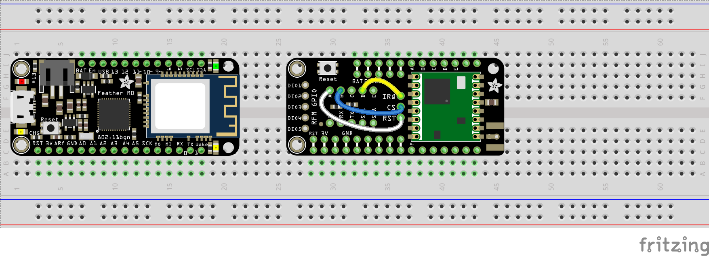
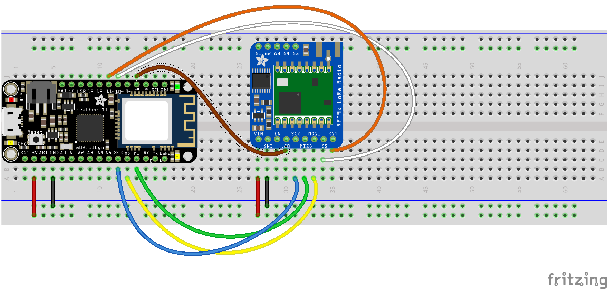
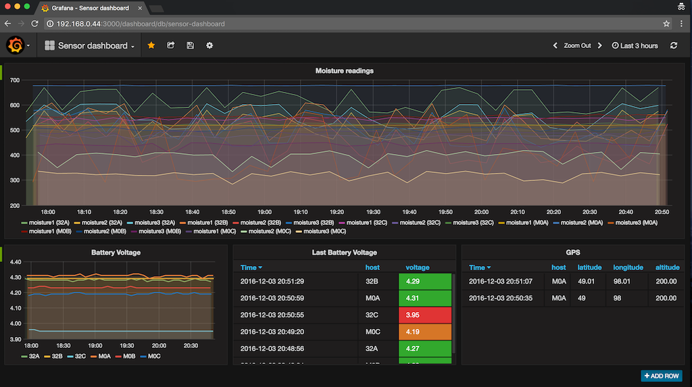

# Remote moisture sensor
This project will use soil moisture sensors that act like resistors. Readings will be taken at defined intervals and sent to Adafruit.io.

There are 2 main parts to this system the Sensor and Gateway. The sensor will collect the readings from the moisture sensor and send it to the Gateway via [LoRa](https://www.lora-alliance.org/) radio. The Gateway will send the data to [Adafruit.io](https://io.adafruit.com/) via [MQTT](http://mqtt.org/). From there you can create charts and graphs of the data that is being collected.

# Sensor
#### Parts
* [moisture sensor](http://www.irrometer.com/sensors.html#wm) you can have up to 5 per Feather
* [LoRa Feather M0](https://www.adafruit.com/product/3179) or [LoRa Feather 32u4](https://www.adafruit.com/product/3078)
* [GPS Feather wing](https://www.adafruit.com/products/3133) (optional) only works with M0 Feather
  * [antenna](https://www.adafruit.com/products/960)
  * [ufl adapter](https://www.adafruit.com/products/851)
* [OLED display](https://www.adafruit.com/products/2900) (optional)

The moisture sensors act as resistors, so what is shown below are potentiometers in their place. The GPS and OLED display are just stacked on top of the LoRa Feather.

You will need to copy [config.h.template](sensor/config.h.template) to config.h and follow the instruction in there on how to create a unique id for each Feather you will be using. This unique id will be part of the MQTT topic so if there are duplicates you will have multiple sensors sending to the same topic and not know which one it came from.

#### Types of messages
###### Sensor data
The analog reading from the sensor will be sent to a topic with the format of station id from config.h and key from data sent. Example: `A-moisture1` will be for station Id `A` and sensor `moisture1`. Battery voltage will also be sent to a topic `A-battery`.

The number of sensors can be adjusted by adding/removing pins from `SENSOR_PINS` in [sensor.ino](sensor/sensor.ino).

Power will only be applied to the sensors while taking a reading via pin `A0`. Constant power to the moisture sensors will cause undo wear.

Example: `A,sensor,moisture1=1.1,moisture2=1.23,moisture3=4.56,battery=3.7`
###### GPS data
GPS data will only be sent when the button is pressed since it is expected that these sensors will not be moving. The GPS data for all Feathers will be sent to a single topic called `gps`. The data value will be the station id. Example: `A`. The latitude, longitude, and elevation will be sent to allow you to map each Feather on a map.

Example: `A,gps,latitude=49.00,longitude=98.00,altitude=200`

# Gateway
#### Parts
* [Wifi Feather M0](https://www.adafruit.com/products/3010)
* [LoRa Wing](https://www.adafruit.com/products/3231) (preferred) or [LoRa breakout](https://www.adafruit.com/products/3072)
* [OLED display](https://www.adafruit.com/products/2900) (optional)

You will need to copy [config.h.template](gateway/config.h.template) to config.h and follow the instruction in there for WIFI and Adafruit.io credentials.

#### LoRa Wing

#### LoRa breakout

# Raspberry Pi
With a Raspberry Pi and the code from [here](https://github.com/kdombeck/moisture-sensor/tree/master/raspberrypi) you can create charts like the following. This can be in addition to the functionality provided by Adafruit.io.

#### Parts
* [Raspberry Pi 3](https://www.adafruit.com/products/3055)
* [Power supply](https://www.adafruit.com/products/1995)
* [Micro SD card](https://www.adafruit.com/products/2693)

