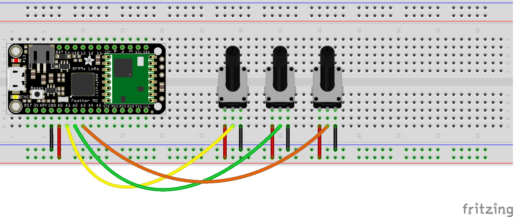

# Remote moisture sensor
This project will use soil moisture sensors that act like resistors. Readings will be taken at defined intervals and sent to Adafruit.io.

There are 2 main parts to this system the Sensor and Gateway. The sensor will collect the readings from the moisture sensor and send it to the Gateway via [LoRa](https://www.lora-alliance.org/) radio. The Gateway will send the data to [Adafruit.io](https://io.adafruit.com/) via [MQTT](http://mqtt.org/). From there you can create charts and graphs of the data that is being collected.

# Sensor
#### Parts
* [moisture sensor](http://www.irrometer.com/sensors.html#wm) you can have up to 5 per Feather
* [LoRa Feather M0](https://www.adafruit.com/product/3179) or [LoRa Feather 32u4](https://www.adafruit.com/product/3078)
* [GPS Feather wing](https://www.adafruit.com/products/3133) (optional) only works with M0 Feather
  * [antenna](https://www.adafruit.com/products/960)
  * [ufl adapter](https://www.adafruit.com/products/851)
* [OLED display](https://www.adafruit.com/products/2900) (optional)

The moisture sensors act as resistors, so what is shown below are potentiometers in their place. The GPS and OLED display are just stacked on top of the LoRa Feather.

You will need to copy [secrets.h.template](sensor/secrets.h.template) to secrets.h and follow the instruction in there on how to create a unique id for each Feather you will be using. This unique id will be part of the MQTT topic so if there are duplicates you will have multiple sensors sending to the same topic and not know which one it came from.

#### Types of messages
###### Sensor data
The analog reading from the sensor will be sent to a topic with the format of `FI` Feather Id from secrets.h `SN` sensor number from SENSOR_PINS array in [sensor.ino](sensor/sensor.ino). Example: `FI-A-SN-1` will be for Feather Id `A` and sensor `1`.
###### Battery voltage
Battery voltage will be sent to a topic for each Feather Id. Example: `FI-A-BAT`.
###### GPS data
GPS data will only be sent when the button is pressed since it is expected that these sensors will not be moving. The GPS data for all Feathers will be sent to a single topic called `gps`. The data value will be the Feather Id. Example: `FI-A`. The latitude, longitude, and elevation will be sent to allow you to map each Feather on a map.

# Gateway
#### Parts
* [Wifi Feather M0](https://www.adafruit.com/products/3010)
* [LoRa breakout](https://www.adafruit.com/products/3072)

The Gateway can be used with or without the Sensors. It does not know anything about the data is is passing along to Adafruit.io.

You will need to copy [secrets.h.template](gateway/secrets.h.template) to secrets.h and follow the instruction in there for WIFI and Adafruit.io credentials.

The only logic it performs on the data it receives is that the first part (everything prior to the first comma) of the message is the MQTT topic that the rest of the data is what will be sent. For example `FI-A-SN-1,123` will be sending data `123` to topic `Your-Username\feeds\FI-A-SN-1`.
